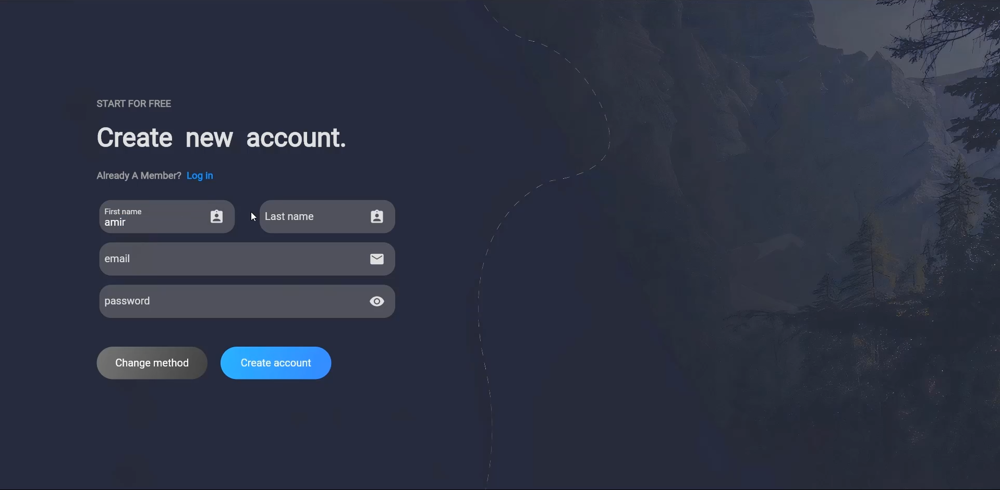

# flutter login page

## Flutter Beautiful Login Web Page UI Design 

### cover


## Development Setup
Clone the repository and run the following commands:

```
flutter pub get
flutter run
```
## ScreenShots




<br><br>
[Watch it on Youtube](https://www.youtube.com/channel/UC6sTNoJi_G_O5lNzc6JgLew)


## Links

* [Website](https://phloxcompany.com)
* [Youtube channel](https://www.youtube.com/channel/UC6sTNoJi_G_O5lNzc6JgLew)
* [Twitter](https://twitter.com/phloxcompany)
* [Instagram](https://instagram.com/phloxcompany)
